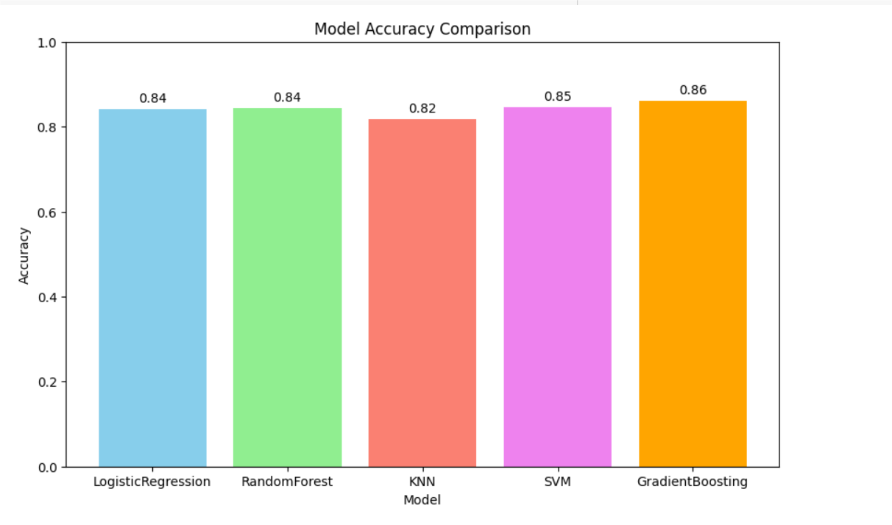
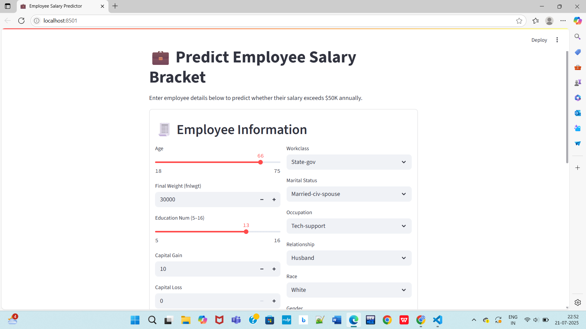
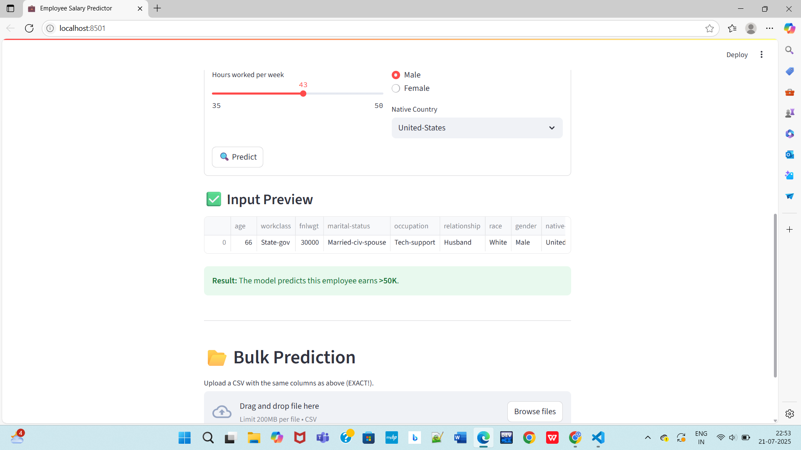
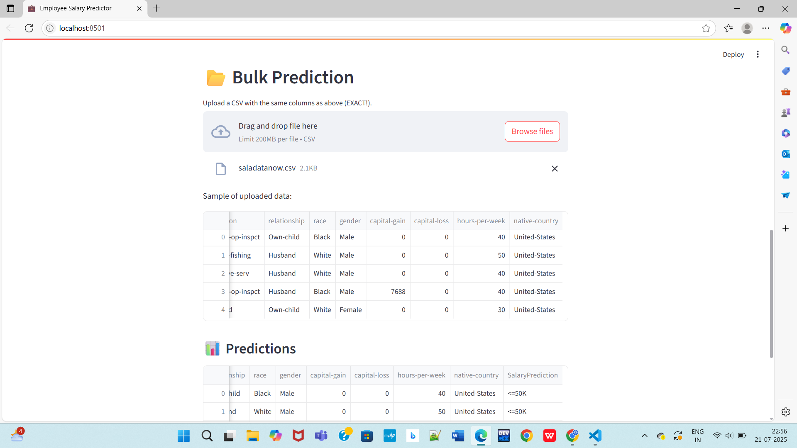
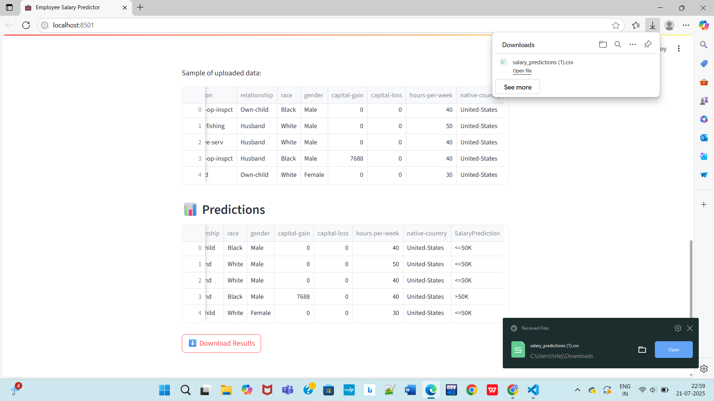
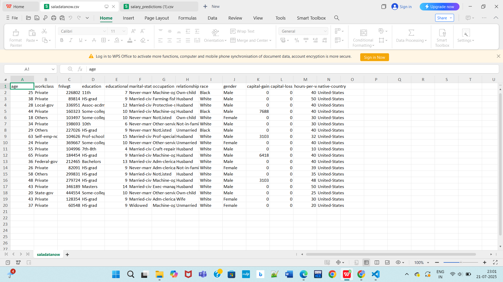
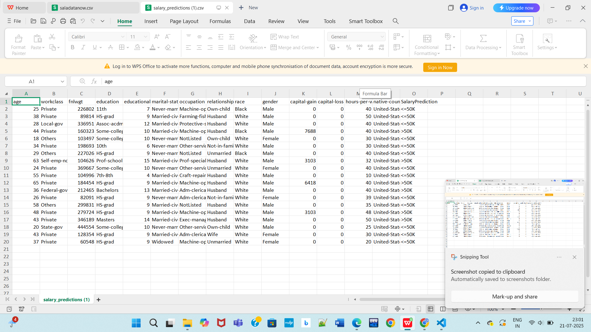

# 💼 Employee Salary Prediction Using Machine Learning

Predict whether an employee earns more than \$50K per year using demographic and work-related attributes, with a fully deployed interactive web app.

---

## 📁 Project Structure
```
employee-salary-prediction-ml/
├── data/
│   └── employee_salary_dataset.csv         # Raw dataset
├── notebooks/
│   └── Employee_salary_prediction.ipynb    # Jupyter Notebook for EDA & training
├── src/
│   ├── train_model.py                      # Python script to train and export model
│   ├── app.py                              # Streamlit app for deployment
├── assets/
│   ├── Model_Comparision.png               # Model accuracy bar graph
│   ├── Screenshot_1.png                    # App input form UI
│   ├── Screenshot_2.png                    # App input form bottom
│   ├── Screenshot_3.png                    # CSV upload for bulk prediction
│   ├── Screenshot_4.png                    # Download CSV result
│   ├── Screenshot_5.png                    # Bulk output CSV open
│   ├── Screenshot_6.png                    # Final predictions in Excel
├── best_model.pkl                          # Saved trained ML pipeline
├── requirements.txt                        # Python dependencies
├── .gitignore
├── LICENSE
└── README.md
```

---

## ✅ Project Objective

- **Goal:** Classify whether an employee’s annual income exceeds $50K based on socio-economic data.
- **Dataset:** Census-like data with multiple demographic & work attributes.
- **Pipeline:** Data cleaning ➜ Feature engineering ➜ Multiple ML models ➜ Best model ➜ Deployed with Streamlit.

---

## ⚙️ Tech Stack

- **Language:** Python 3.x  
- **Libraries:** pandas, scikit-learn, joblib, streamlit, pyngrok  
- **Deployment:** Local Streamlit server + optional Ngrok tunnel for public access

---

## 📊 Model Performance

| Model                        | Accuracy |
|-----------------------------|----------|
| Logistic Regression         | 0.84     |
| Random Forest               | 0.84     |
| K-Nearest Neighbors         | 0.82     |
| Support Vector Machine (SVM)| 0.85     |
| Gradient Boosting           | 0.86 ✅ (Best) |



---

## 🚀 How to Run Locally

### 1️⃣ Clone the Repo
```bash
git clone https://github.com/SivaTeja074/employee-salary-prediction-ml.git
cd employee-salary-prediction-ml
```

### 2️⃣ Install Dependencies
```bash
pip install -r requirements.txt
```

### 3️⃣ Train the Model
```bash
python src/train_model.py
```

### 4️⃣ Run the Streamlit App
```bash
streamlit run src/app.py
```

Open `http://localhost:8501` in your browser ✅

---

## 🖼️ Screenshots

### 🎯 Input Form  


### 🎯 Input Bottom & Prediction  


### 🎯 Bulk CSV Upload  


### 🎯 Download CSV Result  


### 🎯 Output CSV Open  


### 🎯 Final Salary Predictions  


---

## 📈 Results

- ✅ Trained model (`best_model.pkl`) reused for live predictions.  
- ✅ Real-time input + batch CSV supported.  
- ✅ Final predictions downloadable as CSV.  

---

## 🔒 Deployment Note

Use `pyngrok` or your Ngrok CLI to tunnel `localhost:8501` for public access.

Example:
```bash
ngrok http 8501
```

---

## 🔮 Future Scope

- Deploy to Streamlit Cloud, Render, or Heroku  
- Add database for prediction logging  
- Expand dataset with more features  
- Add user authentication  

---

## 📚 References

- scikit-learn Documentation  
- Streamlit Docs  
- UCI Machine Learning Repository – Adult Dataset  
- Dataset: `data/employee_salary_dataset.csv`

---

## 📜 License

This project is licensed under the [MIT License](LICENSE).

---

## 👨‍💻 Author

**Siva Teja Talari**  
[GitHub](https://github.com/SivaTeja074)

---

## ⭐ Contributions

Contributions, issues, and feature requests are welcome!  
Feel free to ⭐ the repo.
